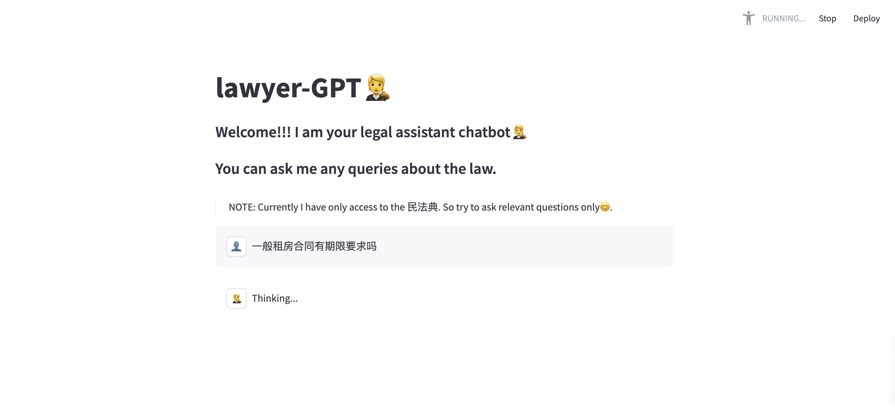
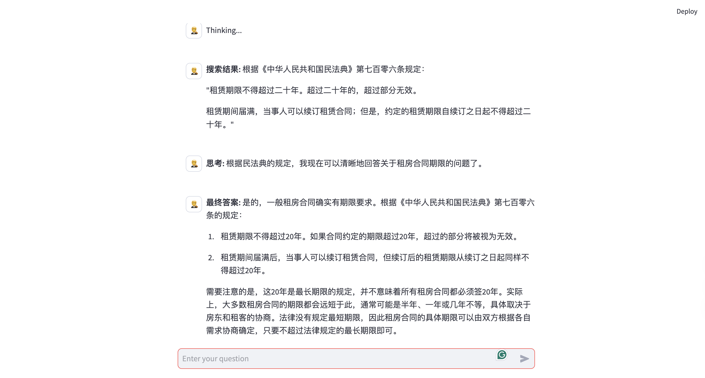

# Lawyer-GPT 法律助手

## 项目简介
Lawyer-GPT是一个基于LangChain和Claude 3.5的法律咨询助手，专门用于解答中国民法典相关的法律问题。该项目使用ReAct框架来实现更透明的推理过程，让用户能够看到AI助手的思考过程。

## 主要特性
- 🔍 智能搜索民法典相关条款
- 💭 展示AI的推理过程（观察、思考、最终答案）
- 🗣️ 支持中文交互
- 📝 保存对话历史
- ⚡ 基于Streamlit的实时交互界面

## 运行结果
以下是系统运行的实际效果展示：


*图1: AI助手回答等待查询结果*


*图2: AI助手输出思考过程和最终答案*

## 技术栈
- LangChain
- Claude 3.5 (通过OneAPI接入)
- Streamlit
- FAISS向量数据库
- HuggingFace Embeddings (sentence-transformers)

## 快速开始

### 环境要求
- Python 3.8+
- pip

### 安装步骤
1. 克隆项目
```bash
bash
git clone https://github.com/your-username/lawyer-gpt.git
cd lawyer-gpt
```


2. 安装依赖
```bash
pip install -r requirements.txt
```

3. 配置环境变量
```bash
export ANTHROPIC_API_KEY=your_api_key
```

4. 运行项目
```bash
streamlit run app.py
```

## 项目结构
lawyer-gpt/
├── app.py # Streamlit应用主入口
├── agent.py # AI代理实现
├── tools/
│ ├── pdf_query_tools.py # PDF查询工具
│ ├── react_prompt_template.py # ReAct提示模板
│ └── data/
│ └── 民法典.pdf # 法律文档
├── tests/ # 单元测试目录
│ ├── test_agent.py # AI代理测试
│ └── test_tool.py # 工具函数测试
└── db/ # FAISS向量数据库存储


## 使用说明
1. 启动应用后，在输入框中输入您的法律问题
2. 系统会自动：
   - 搜索相关法律条款
   - 显示AI的思考过程
   - 给出专业的法律建议
3. 所有对话历史都会被保存在会话中

## 注意事项
- 目前仅支持民法典相关咨询
- 建议使用具体的法律问题以获得更准确的答案
- AI的建议仅供参考，重要法律问题请咨询专业律师

## 贡献指南
欢迎提交Issue和Pull Request来帮助改进项目。

